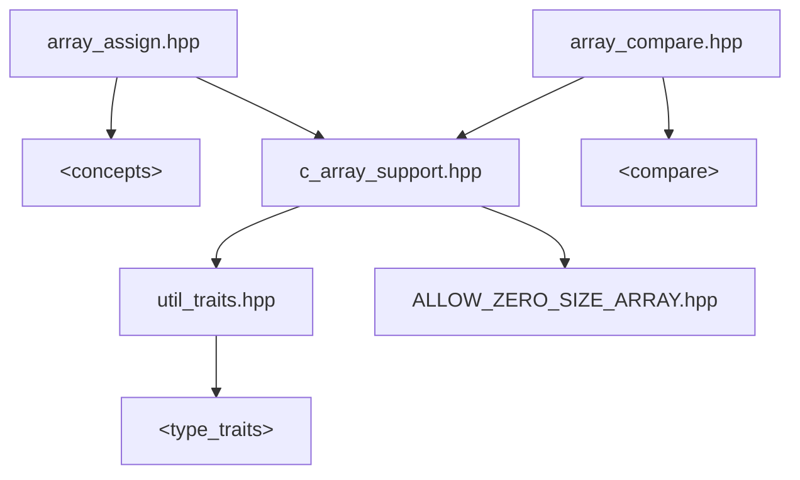

# **`c_array_support`**

## C++20 Concepts, traits and tools for handing C arrays

<details><summary>Copyright &copy; 2023 The Lemuriad. Distributed under the Boost Software License, V1.0</summary>

### **Boost Software License** - Version 1.0 - August 17th, 2003

```txt
Permission is hereby granted, free of charge, to any person or organization
obtaining a copy of the software and accompanying documentation covered by
this license (the "Software") to use, reproduce, display, distribute,
execute, and transmit the Software, and to prepare derivative works of the
Software, and to permit third-parties to whom the Software is furnished to
do so, all subject to the following:

The copyright notices in the Software and this entire statement, including
the above license grant, this restriction and the following disclaimer,
must be included in all copies of the Software, in whole or in part, and
all derivative works of the Software, unless such copies or derivative
works are solely in the form of machine-executable object code generated by
a source language processor.

THE SOFTWARE IS PROVIDED "AS IS", WITHOUT WARRANTY OF ANY KIND, EXPRESS OR
IMPLIED, INCLUDING BUT NOT LIMITED TO THE WARRANTIES OF MERCHANTABILITY,
FITNESS FOR A PARTICULAR PURPOSE, TITLE AND NON-INFRINGEMENT. IN NO EVENT
SHALL THE COPYRIGHT HOLDERS OR ANYONE DISTRIBUTING THE SOFTWARE BE LIABLE
FOR ANY DAMAGES OR OTHER LIABILITY, WHETHER IN CONTRACT, TORT OR OTHERWISE,
ARISING FROM, OUT OF OR IN CONNECTION WITH THE SOFTWARE OR THE USE OR OTHER
DEALINGS IN THE SOFTWARE.
```

[](https://www.boost.org/LICENSE_1_0.txt)

Also at [boost.org](http://www.boost.org/LICENSE_1_0.txt) and accompanying file [LICENSE](LICENSE)

</details>

-----


GitHub Actions meson build: linux gcc10 & 12, clang 12 & 14, macos 12, windows latest

-----

The `"c_array_support.hpp"` header provides:

* Tools for dealing with possibly-nested, possibly zero-size C arrays
* Type traits and concepts for handling C arrays alongside other types  
in type-generic code

The `"array_assign.hpp"` and `"array_compare.hpp"` headers provide:

 * Generic comparison and assignment operations.

In short, support for treating C arrays as more regular types.



Nested C arrays in particular benefit from helper functions that factor out recursions  
(nested C arrays are not much used in C++ but generic code should support them).

Zero-size arrays are outcasts; standard C and C++ languages disallow them, libraries  
ignore them, and compilers have limited support in the form of old C extensions.

Zero-size arrays _are_ arrays too!  
Zero-size arrays _can_ be handled by compilers so generic code should support them.  
This library is proof of feasibility that zero-size arrays can be treated as regular types.

### [Documentation](#documentation.md) page

------------

## `c_array_support.hpp`

Depends on std `<type_traits>` and C++20 language features. 

This header provides a `c_array` concept plus tools and traits for handling possibly-  
nested C arrays as-if flat. All utilities are carefully coded to accept `T[0]` if possible,  
including some std trait replacements fixed to work robustly with `T[0]`.

E.g. `ltl::is_array<int[0]>` is true  
but `std::is_array<int[0]>` is false (on tested compilers, or fails to compile)

### Concepts

* `ltl::c_array<T>`          matches C array, including reference-to-array type
* `ltl::c_array_unpadded<T>` matches C arrays with no padding  
(this 'unpadded' concept is a paranoid addition for protecting casts)

### Replacement `std` traits, robust to `T[0]`
* Predicates:
  * `ltl::is_array_v`
  * `ltl::is_bounded_array_v`
  * `ltl::rank_v`
* Type aliases:
  * `ltl::remove_extent_t`
  * `ltl::remove_all_extents`
  * `ltl::remove_all_extents_t`

(This is not a complete set of replacements
for failing `std` traits.  
&nbsp;The provided traits are the ones that proved most useful so far.)

### Value traits

* `flat_size<A>` yields the total number of elements in flattened array `A`
* `same_extents<A,B>` predicate to tell if `A` and `B` have the same extents

### Type aliases

* `c_array_t<T,N...>` maps variadic `N...` to array type -> `T[N][...]`
* `extent_removed_t<A>` remove_extent, under any reference qualification
* `all_extents_removed_t<A>` same for remove_all_extents
* `flat_cast_t<A>` maps array `A` to 'flattened' 1D array type, preserving cvref

### Functions

* `flat_cast(a)` returns 'flattened' 1D array type, preserving cvref qualification.
* `flat_index(ar,i)` returns the element at index `i` of the flattened array  
`flat_index(arg)` returns  the first 'begin' element of the flattened array  
 (also a reference to 'end' for zero-size) returns `arg` directly if it is not an array.
* `subscript(a,i)` returns `a[i]`, an rvalue if the argument is an array rvalue,  
`subscript(a)` returns `a[0]`, the first element.

The `subscript` function is a workaround for an MSVC issue.

The `c_array_support.hpp` tools are specific to C array, not type-generic tools.  
The remaining two headers add generic support for comparison and assignment.

------------

## array_compare.hpp

Depends on std `<compare>` and `c_array_support.hpp`

This header provides replacements for `std` library facilities
for generic comparison.

### Concepts

* `ltl::three_way_comparable` [`_with`] (c.f. std)
* `ltl::equality_comparable`  [`_with`] (c.f. std)
* `ltl::totally_ordered`      [`_with`] (c.f. std)

### Aliases

* `ltl::compare_three_way_result_t` (c.f. std)

### Functors

* `ltl::compare_three_way`     (c.f. std)
* `ltl::equal_to`              (c.f. std)
* `ltl::not_equal_to`          (c.f. std)
* `ltl::less`                  (c.f. std)

(This is not a complete set of replacement 
comparison functors  
&nbsp;as `compare_three_way` can cover the remaining cases.)

------------

## array_assign.hpp

Depends on std `<concepts>` and `c_array_support.hpp`

### Concepts

* `ltl::empty_list_initializable` (no std equivalent)
* `ltl::empty_list_assignable` (no std equivalent)
* `ltl::assignable_from` (c.f. std)

### Function

* `ltl::assign` (no std equivalent)
